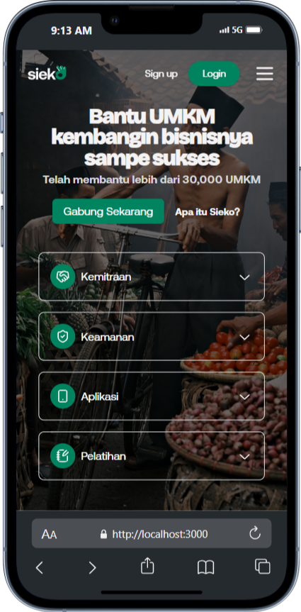

# 🏢 Sieko Company Profile Website

Website company profile modern dan interaktif untuk memperkenalkan platform Sieko — solusi digital terintegrasi untuk membantu UMKM berkembang melalui berbagai layanan seperti ekoFarm, ekoPlier, dan ekoSeller.

---

## 📸 Tampilan Website



---

## 🌐 Deskripsi Proyek

Sieko adalah platform digital yang bertujuan untuk memberdayakan UMKM di Indonesia melalui edukasi dan solusi digital. Website ini dibangun menggunakan Next.js dengan dukungan Tailwind CSS dan animasi interaktif menggunakan Framer Motion dan React Three Fiber.

---

## 🚀 Fitur Utama

- Halaman Hero interaktif dengan animasi angka
- Penjelasan misi & tujuan perusahaan
- Showcase produk: ekoFarm, ekoPlier, ekoSeller
- Responsive Design (Mobile & Desktop)
- Komponen modular dan styling terstruktur
- Animasi dengan Framer Motion & NumberTicker

---

## 🛠️ Teknologi yang Digunakan

- ⚛️ Next.js 14
- 💨 Tailwind CSS
- 🎬 Framer Motion
- 🎨 Lucide Icons, Tabler Icons
- 🌍 React Three Fiber & Drei
- 🧱 Radix UI & ShadCN Components

---

## 📦 Cara Instalasi & Menjalankan

1. **Clone proyek ini**

```bash
git clone https://github.com/anamwebdev/sieko.git
cd sieko
```

2. **Install dependencies**

```bash
npm install
# atau
yarn install
```

3. **Jalankan di development mode**

```bash
npm run dev
```

Lalu buka `http://localhost:3000` di browser.

---

## 📐 Struktur Proyek (Singkat)

```bash
.
├── components/         # Komponen UI reusable (Hero, HeroFeatures, dll)
├── pages/              # Routing halaman Next.js
├── public/             # Gambar, ikon, ilustrasi
├── styles/             # Konfigurasi Tailwind
├── app/                # Entry point App dan layout
├── tsconfig.json       # Konfigurasi TypeScript
├── tailwind.config.ts  # Konfigurasi Tailwind
├── package.json        # Dependensi & script
└── README.md           # Dokumentasi ini
```

---

## 📄 Lisensi

MIT License © 2025 Samsul Anam  
Bebas digunakan dan dimodifikasi untuk keperluan pribadi maupun komersial.

---